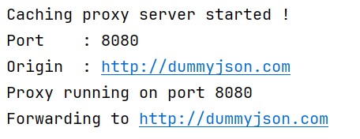

# Caching Proxy CLI Tool

[](https://www.java.com)
[](https://spring.io/projects/spring-boot)
[](https://redis.io/)

A **Caching Proxy Server** built with **Spring Boot** that forwards requests to an origin server and caches responses.  
This project helps me i) develop real backend skills, i) understand caching, and i) build professional-level infrastructure.

---

## What I Learn / Value for Me

**Understand Real-world System Design**
- Learn how caching proxies work (like Cloudflare, NGINX, Varnish)
- Understand request forwarding and cache hits/misses

**Improve Backend Performance Skills**
- Reduce unnecessary API calls
- Learn how to serve responses faster
- Handle caching in memory and with Redis

**Master Caching Techniques**
- Work with Redis as a fast, optionally persistent cache
- Set TTLs (expiration) for cached data
- Cache GET requests effectively

**Foundation for Advanced Projects**
- Prepare for building API Gateways, rate limiters, reverse proxies
- Learn concepts used in scalable microservices and SaaS infrastructure

---

## How It Works
```text
Client → Proxy → Cache (Redis / In-memory) → Origin Server
```

## Architecture Diagram


---

## Project Structure
```
caching-proxy-server/
├── src/
│   └── main/
│       ├── java/
│       │   └── com/yourname/cachingproxy/
│       │       ├── controller/          # Handle HTTP requests
│       │       │   └── ProxyController.java
│       │       ├── proxy/               # Forward to origin server
│       │       │   └── ProxyService.java
│       │       ├── cache/               # Store HIT/MISS responses
│       │       │   └── CacheManager.java
│       │       ├── cli/                 # Parse CLI arguments
│       │       │   └── CLIHandler.java
│       │       ├── config/              # Spring Boot configuration
│       │       │   └── AppConfig.java
│       │       ├── model/               # Model classes
│       │       │   └── CachedResponse.java
│       │       └── CachingProxyServerApplication.java
│       └── resources/
│           └── application.yml          # Default Spring Boot config
├── src/test/                            # Unit tests
├── scripts/                             # Bash scripts for testing
├── README.md                            # Project documentation
├── LICENSE                              # MIT License
├── .gitignore                           # Ignore /target, logs, etc.
├── pom.xml                              # Maven configuration
└── mvnw / mvnw.cmd                      # Maven wrapper
```

---

## Getting Started

### Prerequisites
- Java 17+
- Redis running on `localhost:6379`

### Start the proxy server
```bash
.\mvnw spring-boot:run "-Dspring-boot.run.arguments=--port=8080 --origin=http://dummyjson.com"
```

<!-- SCREENSHOT: Terminal showing server started -->


---

## Testing

### First request — Cache MISS

The first time you call an endpoint, the request is forwarded to the origin server.
```bash
GET http://localhost:8080/products
```

<!-- SCREENSHOT: Postman showing X-Cache: MISS in response headers -->


```
X-Cache: MISS
```

---

### Second request — Cache HIT

The second time you call the same endpoint, the response is returned directly from Redis.
```bash
GET http://localhost:8080/products
```

<!-- SCREENSHOT: Postman showing X-Cache: HIT in response headers -->

```
X-Cache: HIT
```

---

### Clear the cache
```bash
.\mvnw spring-boot:run "-Dspring-boot.run.arguments=--clear-cache"
```

<!-- SCREENSHOT: Terminal showing cache cleared -->

```
Cache cleared successfully.
```